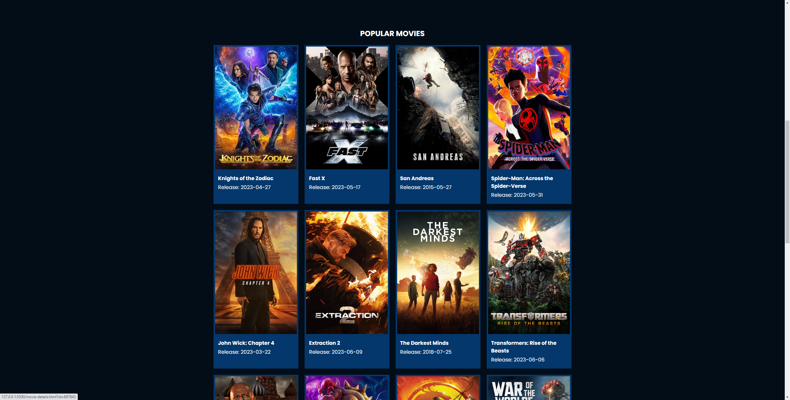

Flixx App 

This is a vanilla javascript project utilizing the tmdb.org API to generate a list of popular movies and TV shows as well as newly aired movies and shows.

The homepage lists the top 20 most popular movies based API calls to tmdb.org.

Project utilizes async functions to await fetch calls and generate the webpage.

Project is hosted at: https://magnificent-kashata-eb1a90.netlify.app/
